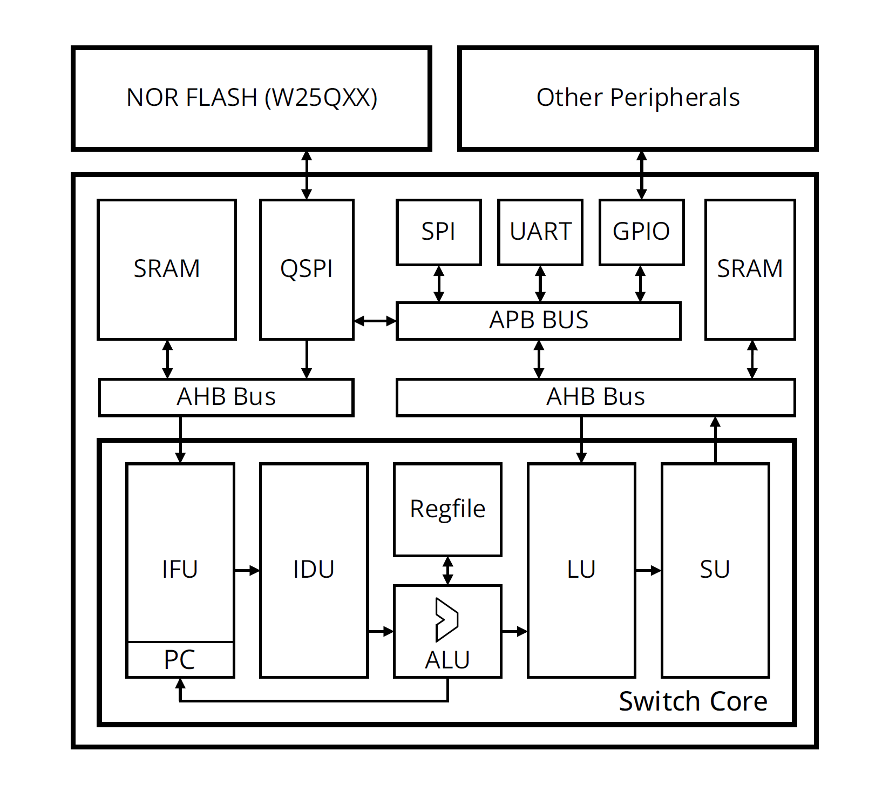

# SwitchMCU



## Background

Over the last decade, the computing industry has steadily moved from CISC to RISC, especially in low-power use cases, or where performance/watt is of utmost importance. This is a direct response to the ever-growing need for more powerful, efficient computing, especially in embedded and edge applications. Our proposed solution is to provide the front-end, RTL design of a pipelined processor (with a currently indeterminate pipeline stage count) that realizes the RV32I instruction set. Additionally, the processor is aimed as a general-purpose biomedical application processor and thus requires integrated interface support, such as SPI, UART, etc. for ADC/DAC and other peripheral control. The aim is to provide a synthesizable RTL core with a fully validated module-level/unit-test level design.

## Architecture

- Harvard architecture
- Support 5-stage pipeline.
- ITCM/DTCM memory for instruction/data storage.
- AMBA AHB bus used for CPU and memory.
- AMBA APB bus used for peripherals.
- Support UART, SPI peripherals.
- Temporarily no cache and MMU.

## Tool chains

Tools for team members

- for RTL designers
  - Verilator
  - GTKWave
- for verification engineers
  - Verilator
  - GTKWave
  - Qt
  - Unicorn Engine
  - Capstone
  - GNU Multiple Precision Arithmetic Library (GMP) 
- for system engineers
  - Qt
  - Unicorn Engine
  - RISC-V GNU Compiler Toolchain
  - Capstone
  - GNU Multiple Precision Arithmetic Library (GMP) 
  - QEMU
- for CAD engineers
  - Qt
  - Verilog-Perl
  - Verilator
- for FPGA prototype verification
  - Verilator
  - GTKWave
  - GOWIN Integrated Development Environment (IDE)

Introduction of tools

- Verilator

  https://verilator.org/guide/latest/install.html

  Verilator is a free, open-source tool used to convert Verilog (a hardware description language) code into C++ or SystemC code. Primarily, it's utilized for simulation purposes, allowing designers to test their digital circuits in a high-level programming environment.

- GTKWave

  https://gtkwave.sourceforge.net/

  GTKWave is an open-source waveform viewer that can display VCD (Value Change Dump), LXT, LXT2, VZT, FST, and many other types of simulation output files. It's particularly popular in the FPGA and ASIC design communities for its ability to visually represent signals over time, allowing designers to debug and verify their digital circuits.

- Qt

  https://www.qt.io/download-open-source

  Qt is a free and open-source widget toolkit for creating graphical user interfaces (GUIs) as well as cross-platform applications that run on various software and hardware platforms. Founded by Trolltech in 1991, Qt has evolved to be one of the primary choices for developers when targeting both desktop and mobile platforms.

- Unicorn Engine

  https://www.unicorn-engine.org/

  Unicorn is a lightweight, multi-platform, multi-architecture CPU emulator framework. Based on QEMU's virtualization engine, Unicorn allows developers to emulate CPU execution for various architectures, making it invaluable for tasks like reverse engineering, malware analysis, and debugging.

- RISC-V GNU Compiler Toolchain

  https://github.com/riscv-collab/riscv-gnu-toolchain

  The RISC-V GNU Compiler Toolchain is a collection of tools designed to support the development of software for RISC-V based architectures. It includes key components such as the GNU Compiler Collection (GCC), the GNU Binary Utilities (Binutils), and the GNU Debugger (GDB) which have been modified and extended to support the RISC-V instruction set architecture.

- Capstone

  https://www.capstone-engine.org/

  Capstone is an open-source disassembly framework that's designed to decode binary code into human-readable assembly instructions. It provides programming interfaces for multiple languages, enabling detailed inspection of binary code in applications such as reverse engineering, malware analysis, and debugger development.

- GNU Multiple Precision Arithmetic Library (GMP) 

  https://gmplib.org/

  GMP, standing for the GNU Multiple Precision Arithmetic Library, is a free and open-source software library for arbitrary-precision arithmetic. It provides capabilities for working with large numbers, far beyond the native capacities of standard programming languages. GMP offers high precision arithmetic for signed integers, rational numbers, and floating-point numbers.

- Verilog-Perl

  https://github.com/veripool/verilog-perl

  Verilog-Perl is a collection of Perl utilities for parsing and processing Verilog code. It's especially useful for Electronic Design Automation (EDA) tasks and engineers working extensively with Verilog, a hardware description language (HDL) commonly used for designing digital circuits.

- QEMU

  https://www.qemu.org/

  QEMU, which stands for "Quick Emulator," is a free and open-source hosted hypervisor that performs hardware virtualization. It emulates CPUs through dynamic binary translation and provides a set of device models, allowing it to run a variety of unmodified guest operating systems. QEMU can be used in standalone mode or in conjunction with KVM (Kernel-based Virtual Machine) to run virtual machines at near-native speed.

- OpenOCD

  https://openocd.org/

  OpenOCD is a versatile and powerful open-source tool that provides debugging and programming capabilities for a wide range of embedded systems and microcontrollers. It serves as a bridge between your development environment and the target hardware, enabling you to interact with and control microcontrollers for tasks such as debugging, flashing firmware, and accessing on-chip resources.

- GOWIN Integrated Development Environment (IDE)

  https://www.gowinsemi.com/en/support/home/

  The GOWIN IDE provides a comprehensive platform for FPGA development. It allows users to design, simulate, and program GOWIN FPGA devices.

## Prerequisites

1. #### Getting the sources

   ```shell
   git clone https://github.com/Rice-MECE-Capstone-Projects/SwitchMCU.git
   ```

2. Install verilator

   ```shell
   # Prerequisites:
   #sudo apt-get install git help2man perl python3 make autoconf g++ flex bison ccache
   #sudo apt-get install libgoogle-perftools-dev numactl perl-doc
   #sudo apt-get install libfl2  # Ubuntu only (ignore if gives error)
   #sudo apt-get install libfl-dev  # Ubuntu only (ignore if gives error)
   #sudo apt-get install zlibc zlib1g zlib1g-dev  # Ubuntu only (ignore if gives error)
   
   git clone https://github.com/verilator/verilator   # Only first time
   
   # Every time you need to build:
   unsetenv VERILATOR_ROOT  # For csh; ignore error if on bash
   unset VERILATOR_ROOT  # For bash
   cd verilator
   git pull         # Make sure git repository is up-to-date
   git tag          # See what versions exist
   #git checkout master      # Use development branch (e.g. recent bug fixes)
   #git checkout stable      # Use most recent stable release
   #git checkout v{version}  # Switch to specified release version
   
   autoconf         # Create ./configure script
   ./configure      # Configure and create Makefile
   make -j `nproc`  # Build Verilator itself (if error, try just 'make')
   sudo make install
   ```

3. Install Gtkwave

   ```shell
   sudo apt-get update
   sudo apt-get install gtkwave
   gtkwave --version
   ```

4. Install RISC-V GNU Compiler Tool chain

   ```shell
   git clone https://github.com/riscv/riscv-gnu-toolchain
   sudo apt-get install autoconf automake autotools-dev curl python3 python3-pip libmpc-dev libmpfr-dev libgmp-dev gawk build-essential bison flex texinfo gperf libtool patchutils bc zlib1g-dev libexpat-dev ninja-build git cmake libglib2.0-dev
   ./configure --prefix=/opt/riscv --enable-multilib
   make
   ```

5. Install Unicorn Engine

   ```shell
   git clone https://github.com/unicorn-engine/unicorn.git
   sudo apt install cmake pkg-config
   mkdir build; cd build
   cmake .. -DCMAKE_BUILD_TYPE=Release
   make
   ```

6. Install Capstone

   ```shell
   ./make.sh
   sudo ./make.sh install
   ```

7. Install GMP

   ```shell
   ./configure
   make
   make check
   make install
   ```

8. Install QEMU

   ```shell
   wget https://download.qemu.org/qemu-8.2.0-rc1.tar.xz
   tar xvJf qemu-8.2.0-rc1.tar.xz
   cd qemu-8.2.0-rc1
   ./configure
   make
   ```


## Testing Platform

- #### C++ based SoC emulator

  #### under construction

- #### FPGA prototype platform

  #### Tang Nano 20K is a development board, using the [GW2AR-18 QN88](http://www.gowinsemi.com.cn/prod_view.aspx?TypeId=10&FId=t3:10:3&Id=167#GW2AR) FPGA, containing 20736 LUT4 logic cells and 15552 Filp-Flops. There are 2 PLL in this FPGA chip, and many DSP units supporting 18 bit x 18 bit multiplication. Onboard [BL616](https://bouffalolab.com/product/?type=detail&id=21) is used for downloading bitstream into FPGA, and it's also used as USB to serial convertor to communicate FPGA with computer via UART. The 27MHz crystal generates the clock for HDMI display, onboard MS5351 clock generating chip also provides mutiple clocks.

  

  


## Project Final Report

- IC Design team final report from ELEC 594 Capstone Project in Fall 2023 at Rice University.

  https://github.com/Rice-MECE-Capstone-Projects/SwitchMCU/blob/main/doc/ELEC594_Capstone_project_report_RISC_V_RV32I_IC_.pdf


## Reference

- riscv-operating-system-mooc

  https://github.com/plctlab/riscv-operating-system-mooc

- AHB 5 protocol specification

  https://documentation-service.arm.com/static/6141bf0d674a052ae36ca811?token=

- APB protocol specification

  https://developer.arm.com/documentation/ihi0024/latest/

- RISC-V Specifications

  https://riscv.org/technical/specifications/
