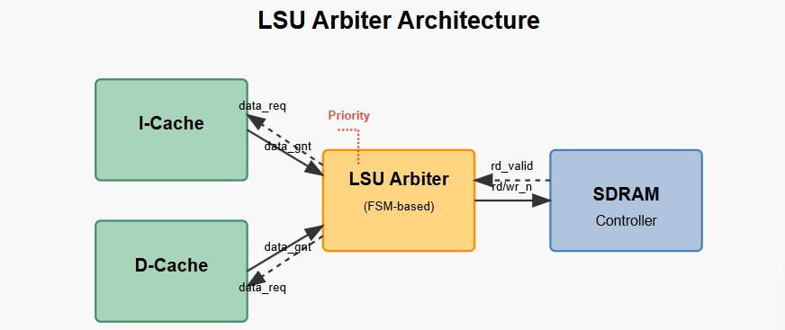

# LSU Arbiter
## Overview
The LSU (Load Store Unit) Arbiter is a hardware module designed to manage and prioritize memory access requests between instruction cache (I-cache) and data cache (D-cache) interfaces to an SDRAM controller. This repository contains the Verilog implementation of the arbiter module and a comprehensive testbench to verify its functionality.

## Key Features
- Priority-based arbitration between I-cache and D-cache (I-cache has higher priority)
- Support for both read and write operations
- FSM-based design with clean transitions between states
- Byte-enable support for partial word writes
- Complete signal handshaking with request, grant, and valid signals
- 32-bit data width operations

#### Resource Utilization
The LSU Arbiter is designed to be lightweight:
- Simple two-state FSM
- Minimal registers for request tracking
- Efficient multiplexing of signals

#### Module Architecture
The LSU Arbiter acts as an interface between:
- Instruction Cache (I-cache)
- Data Cache (D-cache)
- SDRAM Controller

#### State Machine
The arbiter implements a simple FSM with two states:
- IDLE: Ready to accept new requests
- BUSY: Processing an ongoing request



## Interface Description
#### I-cache and D-cache Interfaces
Both cache interfaces share the same signal structure:
- data_req: Request signal
- data_addr[31:0]: Memory address
- data_we: Write enable (0 for read, 1 for write)
- data_be[3:0]: Byte enable signals
- data_wdata[31:0]: Write data (when data_we=1)
- data_gnt: Grant signal (output)
- data_rvalid: Read data valid (output)
- data_rdata[31:0]: Read data (output)

#### SDRAM Controller Interface
- L_sdrc_wr_n: Write enable (active low)
- L_sdrc_rd_n: Read enable (active low)
- L_sdrc_addr[31:0]: Memory address
- L_sdrc_dqm[3:0]: Data mask (inverted byte enable)
- L_sdrc_data_len[7:0]: Data length (fixed at 4 bytes)
- L_sdrc_data[31:0]: Write data
- O_sdrc_busy_n: SDRAM ready signal (active low)
- O_sdrc_data[31:0]: Read data from SDRAM
- O_sdrc_rd_valid: Read data valid

## Operation Principles
- In the IDLE state, the arbiter monitors for memory access requests from I-cache and D-cache
- When requests are present, I-cache is given priority over D-cache
- Once a request is granted, the arbiter transitions to the BUSY state
- For write operations, the arbiter returns to IDLE after the write is initiated
- For read operations, the arbiter waits for the SDRAM to return valid data before returning to IDLE
- Appropriate address, data, and control signals are forwarded to the SDRAM controller

## Usage
#### Testbench
Please refer to [LSU_Arbiter_Testbench.md](resource/tb-lsu-arbiter-testbench.md) for the testbench documentation.
#### Simulation
To simulate the design using a Verilog simulator like Icarus Verilog:
```bash
iverilog -o test lsu_arbiter.v tb_lsu_arbiter_tb.v
vvp test
```
To view waveforms:
```bash
gtkwave arbiter.vcd
```

#### Integration
To use this module in your design:
- Include the arbiter.v file in your project
- Instantiate the module with appropriate connections to your cache and SDRAM controller
- Ensure correct clock domain and reset handling

## Future Improvements
Potential enhancements for future versions:
- Configurable priority scheme
- Support for burst transactions
- Timeout mechanism for stalled transactions
- Performance counters for monitoring

## License
Apache License
Version 2.0, January 2004
