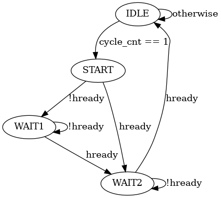

# ifu_swc

## Overview

This module is an instruction fetch unit, designed to retrieve instructions from memory based on the address in the PC (Program Counter) register and forward them to the next level of the pipeline. Its clock signal is hclk, and the reset signal is hrstn. The module connects to the memory through the AHB bus and includes pipeline stall control signals to pause this stage of the pipeline when needed.
The signal ifu\_idle indicates the idle state of the instruction fetch unit. This signal is used to show whether the fetch unit is idle. When it is idle and the cycle\_cnt (cycle count) reaches 4, cycle\_cnt is reset to 0, allowing the pipeline to proceed to the next cycle. The pc\_write and pc\_wdata signals control the override of the PC register. When the pc\_write signal is active, the PC register is updated with the value from pc\_wdata, allowing the execution unit to control the PC register for implementing branch and jump instructions. The inst\_out signal is used to output the result of the current fetch to the decoder. The module defines a state machine with four states to control AHB transfers. Among these, the WAIT1 state is designated for waiting for the first 'hready' signal to transfer the address and control signals. Conversely, the WAIT2 state is utilized for waiting for the second 'hready' signal to acquire the required instructions from memory. The transitions between these states are as shown below.

## Signals

1. **`hclk`**: The hardware clock signal, driving the synchronous elements of the module.
2. **`hrstn`**: The hardware reset signal (active low), used to reset the state of the IFU.
3. **`haddr`**: This output register holds the address for memory access operations on the AHB bus.
4. **`hwrite`**: An output signal indicating whether the current AHB bus transaction is a write (1) or read (0) operation. In this case, it's always read, as indicated by the constant assignment to 0.
5. **`hwdata`**: The output register for data to be written to the memory system during write operations.
6. **`hsize`**: An output signal specifying the size of the data transfer on the AHB bus. It is set to 2, indicating a specific size (likely 32 bits).
7. **`hburst`**: An output signal indicating the type of burst transfer on the AHB bus. It's constant at 0, indicating no burst transfer.
8. **`hprot`**: This output register specifies the protection level of the memory transaction.
9. **`htrans`**: An output register indicating the type of transaction on the AHB bus. It can be idle, busy, non-sequential, or sequential.
10. **`hmastlock`**: An output signal indicating if the bus master (IFU in this case) requires exclusive access. It is always 0, indicating no lock.
11. **`hready`**: An input signal from the memory system indicating readiness to complete a transaction.
12. **`hresp`**: An input signal indicating the response status of the current transaction (success, error).
13. **`hrdata`**: The input data from the memory system, used to fetch instructions.
14. **`itcm_ready`**: An input signal indicating if the Instruction Tightly Coupled Memory (ITCM) is ready.
15. **`ifu_idle`**: An output signal indicating whether the IFU is idle.
16. **`ifu_dec_stall`**: An input signal indicating a stall condition from the decoder.
17. **`cycle_cnt`**: An input signal representing the current cycle count, used to synchronize operations.
18. **`pc_write`**: An input signal indicating if the Program Counter (PC) should be updated with new data (`pc_wdata`).
19. **`pc_wdata`**: The input data with which to update the PC.
20. **`pc`**: The output register holding the current value of the Program Counter.
21. **`inst_out`**: The output register holding the fetched instruction.