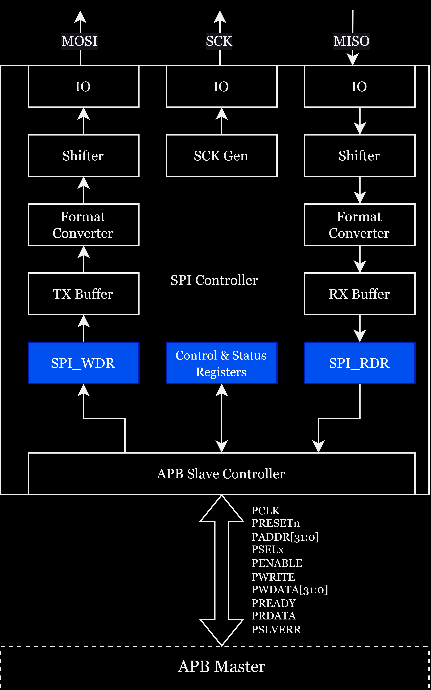

# Switch Microcontroller Technical Reference Manual

Edited by nand@Rice

# Preface

## Background

Over the last decade, the computing industry has steadily moved from CISC to RISC, especially in low-power use cases, or where performance/watt is of utmost importance. This is a direct response to the ever-growing need for more powerful, efficient computing, especially in embedded and edge applications. Our proposed solution is to provide the front-end, RTL design of a pipelined processor (with a currently indeterminate pipeline stage count) that realizes the RV32I instruction set. Additionally, the processor is aimed as a general-purpose biomedical application processor and thus requires integrated interface support, such as SPI, UART, etc. for ADC/DAC and other peripheral control. The aim is to provide a synthesizable RTL core with a fully validated module-level/unit-test level design.

## About “Switch”

- More leeway than "Open”.
- I don't want to use the guise of open source, maybe one day it will be closed source.

## Architecture

- Harvard architecture
- Support 5-stage pipeline.
- ITCM/DTCM memory for instruction/data storage.
- AMBA AHB bus used for CPU and memory.
- AMBA APB bus used for peripherals.
- Support UART, SPI peripherals.
- Temporarily no cache and MMU.

## Debug

- Support ICP(In Circuit Programing) and ISP(In System Programing).
- Support OpenOCD + GDB for programming and debugging.
- Use the JTAG protocol (this is probably the most difficult part).

## Toolchain and reference

- Icarus Verilog
- Verilator
- GTKWave
- RISC-V GNU Toolchain
- Sifive Freedom E SDK

# 0.  Documentation conventions

# 1. Memory and bus architecture

# 2. Reset and clock control (RCC)

# 3. Interrupts and events

# 4. General-purpose and alternate-function I/Os (GPIOs and AFIOs)

# 5. Serial peripheral interface (SPI)

### 5.1 SPI introduction

The Serial Peripheral Interface (SPI) allows a chip to communicate with external devices in full duplex, synchronous, serial fashion. This interface can be configured in master mode, providing the communication clock (SCK) for external slave devices.

### 5.2 SPI features

- 3-wire full duplex synchronous transmission
- Selection of 8 or 16-bit transfer frame format
- 8 master mode baud rate pre-scaling factors (up to fPCLK/2)
- Slave mode frequency (up to fPCLK/2)
- Rapid communication in both master and slave modes
- Programmable clock polarity and phase
- Programmable data order, MSB first or LSB first
- SPI bus busy status flag

### 5.3 SPI functional description

The block diagram of the SPI Controller is shown below.

- MISO: Master In/Slave Out data. This pin can be used to transmit data in slave mode and receive data in master mode.
- MOSI: Master Out/Slave In data. This pin can be used to transmit data in master mode and receive data in slave mode.
- SCK: Serial Clock output for SPI masters and input for SPI slaves.

### 5.4 SPI registers

1. SPI Control Register (SPI_CR)

   Address offset: 0x00
   
   Reset value: 0x0000

   | 31-24    | 23      | 22      | 21      | 20-19    | 18      | 17      | 16      |
   | -------- | ------- | ------- | ------- | -------- | ------- | ------- | ------- |
   | RESERVED | TXEIE   | RXNEIE  | ERRIE   | RESERVED | SSOE    | TXDMAEN | RXDMAEN |
   | RESERVED | INVALID | INVALID | INVALID | RESERVED | INVALID | INVALID | INVALID |
   
   | 15       | 14      | 13      | 12      | 11    | 10     | 9       | 8       | 7        | 6     | 5 - 3 | 2       | 1     | 0     |
   | -------- | ------- | ------- | ------- | ----- | ------ | ------- | ------- | -------- | ----- | ----- | ------- | ----- | ----- |
   | BIDIMODE | BIDIOE  | CRCEN   | CRCNEXT | DFF   | RXONLY | SSM     | SSI     | LSBFIRST | SPE   | BR    | MSTR    | CPOL  | CPHA  |
   | INVALID  | INVALID | INVALID | INVALID | VALID | VALID  | INVALID | INVALID | VALID    | VALID | VALID | INVALID | VALID | VALID |
   
   - **Bit 31-24 - RESERVED**
   - **Bit 23 - TXEIE**: Tx buffer empty interrupt enable
   
     - 0: TXE interrupt masked
     - 1: TXE interrupt not masked
     - **Will not be implemented in this design**
     
   - **Bit 22 - RXNEIE**: RX buffer not empty interrupt enable
   
     - 0: RXNE interrupt masked
     - 1: RXNE interrupt not masked
     - **Will not be implemented in this design**
     
   - **Bit 21 - ERRIE**: Error interrupt enable
     
     - 0: Error interrupt masked
     - 1: Error interrupt not masked
     - **Will not be implemented in this design**
     
   - **Bit 20-19 - RESERVED**
     
   - **Bit 18 - SSOE**: SS output enable
     
     - 0: SS pin is used as general-purpose I/O (GPIO)
     - 1: SS pin is used as SS output
     - **Will not be implemented in this design**
   - **Bit 17 - TXDMAEN**: Transmit buffer DMA enable
   
     - 0: DMA disabled
     - 1: DMA enabled for transmission
     - **Will not be implemented in this design**
   - **Bit 16 - RXDMAEN**: Receive buffer DMA enable
   
     - 0: DMA disabled
     - 1: DMA enabled for reception
     - **Will not be implemented in this design**
   - **Bit 15 - BIDIMODE**: Bidirectional Data Mode Enable
     
     - 0: 2-line unidirectional data mode selected
     - 1: 1-line bidirectional data mode selected
     - **Will not be implemented in this design**
   - **Bit 14 - BIDIOE**: Output Enable in Bidirectional Mode
     - 0: Output disabled (receive-only mode)
     - 1: Output enabled (transmit-only mode)\
     - **Will not be implemented in this design**
   - **Bit 13 - CRCEN**: Hardware CRC Calculation Enable
     - 0: CRC calculation disabled
     - 1: CRC calculation enabled
     - **Will not be implemented in this design**
   - **Bit 12 - CRCNEXT**: Transmit CRC Next
     - 0: Next transmit value is from Tx buffer
     - 1: Next transmit value is CRC value
     - **Will not be implemented in this design**
   - **Bit 11 - DFF**: Data Frame Format
     - 0: 8-bit data frame format is selected for transmission/reception
     - 1: 16-bit data frame format is selected for transmission/reception
   - **Bit 10 - RXONLY**: Receive Only
     - 0: Full duplex (Transmit and receive)
     - 1: Output disabled (Receive-only mode)
   - **Bit 9 - SSM**: Software Slave Management
     - 0: Software slave management disabled
     - 1: Software slave management enabled
     - **Will not be implemented in this design**
   - **Bit 8 - SSI**: Internal Slave Select
     - 0: Slave mode
     - 1: Master mode
     - **Will not be implemented in this design**
   - **Bit 7 - LSBFIRST**: Frame Format
     - 0: Data is transmitted/received with the MSB first
     - 1: Data is transmitted/received with the LSB first
   - **Bit 6 - SPE**: SPI Enable
     - 0: Peripheral disabled
     - 1: Peripheral enabled
   - **Bits 5-3 - BR**: Baud Rate Control
     - 000： fPCLK/2
     - 001： fPCLK/4
     - 010： fPCLK/8
     - 011： fPCLK/16
     - 100： fPCLK/32
     - 101： fPCLK/64
     - 110： fPCLK/128
     - 111： fPCLK/256
   - **Bit 2 - MSTR**: Master Selection
     - 0: Slave configuration
     - 1: Master configuration
     - **Will not be implemented in this design**
   - **Bit 1 - CPOL**: Clock Polarity
     - 0: CK to 0 when idle
     - 1: CK to 1 when idle
   - **Bit 0 - CPHA**: Clock Phase
     - 0: The first clock transition is the first data capture edge
     - 1: The second clock transition is the first data capture edge

2. SPI Status Register (SPI_SR)

     Address offset: 0x04

     Reset value: 0x0002

     | 31-16    |
     | -------- |
     | RESERVED |
     | RESERVED |

     | 15-8     | 7     | 6     | 5     | 4       | 3       | 2       | 1     | 0     |
     | -------- | ----- | ----- | ----- | ------- | ------- | ------- | ----- | ----- |
     | RESERVED | BSY   | OVR   | MODF  | CRCERR  | UDR     | CHSIDE  | TXE   | RXNE  |
     | RESERVED | VALID | VALID | VALID | INVALID | INVALID | INVALID | VALID | VALID |

     - **Bit 31-8 - RESERVED**

     - **Bit 7 - BSY**: Busy flag

       - 0: SPI not busy

       - 1: SPI is busy (transfer on-going)

     - **Bit 6 - OVR**: Overrun flag

       - 0: No overrun occurred

       - 1: Overrun occurred

     - **Bit 5 - MODF**: Mode fault

       - 0: No mode fault occurred

       - 1: Mode fault occurred

     - **Bit 4 - CRCERR**: CRC error flag

       - 0: CRC value received matches the SPI_DR CRC field

       - 1: CRC value received does not match the SPI_DR CRC field

     - **Bit 3 - UDR**: Underrun flag

       - 0: No underrun occurred

       - 1: Underrun occurred

     - **Bit 2 - CHSIDE**: Channel side

       - 0: Channel left has data to be sampled

       - 1: Channel right has data to be sampled

     - **Bit 1 - TXE**: Transmit buffer empty

       - 0: Transmit buffer not empty

       - 1: Transmit buffer empty

     - **Bit 0 - RXNE**: Receive buffer not empty

       - 0: Receive buffer is empty

       - 1: Receive buffer not empty

3. SPI Write Data Register (SPI_WDR)

   Address offset: 0x08

   Reset value: 0x0000

   | 31 - 0 |
   | ------ |
   | DR     |
   | VALID  |

4. SPI Read Data Register (SPI_RDR)

   Address offset: 0x0C

   Reset value: 0x0000

   | 31 - 0 |
   | ------ |
   | DR     |
   | VALID  |

# 6. Universal asynchronous receiver transmitter (UART)

### 6.1 UART introduction

UART (Universal Asynchronous Receiver-Transmitter) is a hardware communication protocol for asynchronous serial communication, where data is typically transmitted byte-by-byte between two devices. It utilizes separate transmit and receive lines, along with an optional ground, without the need for a clock signal. Due to its simplicity and ubiquity, UART is a standard communication tool in many microcontrollers, computers, and communication devices.

### 6.2 UART features

- Full-duplex, asynchronous communication
- Fractional baud rate generator system
  - Shared programmable baud rate for both transmission and reception
- Programmable data word length (8-bit or 9-bit)
- Configurable stop bits - supports 1 or 2 stop bits
- Separate transmitter and receiver enable bits
- Detection flags:
  - Receive buffer full
  - Transmit buffer empty
  - Transmission complete flag
- Error detection flags (TBD)

### 6.3 UART functional description

The block diagram of the UART Controller is shown below.

### 6.4 UART registers

1. 

