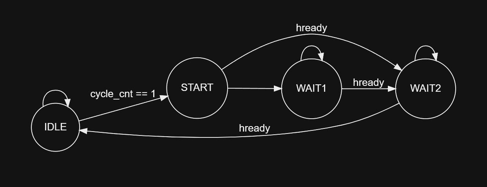

# Switch Microcontroller Technical Reference Manual

Edited by nand@Rice

# 0. Preface

## Background

Over the last decade, the computing industry has steadily moved from CISC to RISC, especially in low-power use cases, or where performance/watt is of utmost importance. This is a direct response to the ever-growing need for more powerful, efficient computing, especially in embedded and edge applications. Our proposed solution is to provide the front-end, RTL design of a pipelined processor (with a currently indeterminate pipeline stage count) that realizes the RV32I instruction set. Additionally, the processor is aimed as a general-purpose biomedical application processor and thus requires integrated interface support, such as SPI, UART, etc. for ADC/DAC and other peripheral control. The aim is to provide a synthesizable RTL core with a fully validated module-level/unit-test level design.

## About “Switch”

- More leeway than "Open”.
- I don't want to use the guise of open source, maybe one day it will be closed source.

## Architecture

- Harvard architecture
- Support 5-stage pipeline.
- ITCM/DTCM memory for instruction/data storage.
- AMBA AHB bus used for CPU and memory.
- AMBA APB bus used for peripherals.
- Support UART, SPI peripherals.
- Temporarily no cache and MMU.

## Debug

- Support ICP(In Circuit Programing) and ISP(In System Programing).
- Support OpenOCD + GDB for programming and debugging.
- Use the JTAG protocol (this is probably the most difficult part).

## Toolchain and reference

- Icarus Verilog
- Verilator
- GTKWave
- RISC-V GNU Toolchain
- Sifive Freedom E SDK

# 1. Core

#### 1.0 Overview of AHB

1. **HADDR**: This is the "Address Bus". It's used to specify the address of the data that the master requires during a bus transfer.
2. **HWRITE**: The "Write Control" signal. This signal indicates whether the current transfer is a read or write operation. A HIGH signal (logic 1) usually indicates a write operation, while a LOW signal (logic 0) indicates a read operation.
3. **HWDATA**: The "Write Data Bus". This carries the data to be written during write operations.
4. **HSIZE**: The "Transfer Size" signal. It indicates the size of the data transfer, which can vary (e.g., byte, half-word, word).
5. **HPROT**: The "Protection Control" signal. This is used to provide information about the nature of the access being performed, such as whether it's a non-privileged access, cacheable, bufferable, etc.
6. **HBURST**: The "Burst Type" signal. It indicates the type of burst being performed during the transfer, such as single transfer, incremental burst, etc.
7. **HTRANS**: The "Transfer Type" signal. This signal indicates the type of the current transfer, like non-sequential, sequential, idle, etc.
8. **HMASTLOCK**: The "Master Lock" signal. This is used by the master to indicate a locked transfer, which is a mechanism to retain control of the bus during a sequence of transfers.
9. **HREADY**: The "Transfer Ready" signal. It indicates whether the slave is ready to complete the current transfer. If LOW, it indicates wait states.
10. **HRESP**: The "Transfer Response" signal. This signal is used by the slave to inform the master about the status of the transfer, indicating either OKAY or ERROR.
11. **HRDATA**: The "Read Data Bus". This carries the data that has been read during read operations.

#### 1.1 Testbench

In the MCU design files located at SwitchMCU/rtl/chip, there's a test stimulus file named chip_tb.v. This file interacts with three main signals: the clock (hclk), reset (hrstn), and the ready signal for ITCM. The hclk is the clock for the AHB bus and also serves as the core clock for the entire system, with a planned frequency of 72MHz. Hrstn is the reset signal for the AHB bus and acts as the global reset signal. The ready signal is pulled high once the ITCM is prepared, indicating whether the ROM file has been loaded into the code memory. When this signal is high, instruction fetching begins, and the core's pipeline starts operating.

There are also two parameters in this file: ITCM_DATA_PATH, which indicates the file that should be initially loaded into the instruction memory, and DTCM_DATA_PATH, for the file to be loaded into the data memory. In actual chip testing, these contents would be pre-stored in flash and loaded into memory upon power-up.

Additionally, the file instantiates the chip_top module. The parameters ITCM_BASE_ADDRESS and DTCM_BASE_ADDRESS are used to define the starting addresses of the two memory blocks.

After simulation with simulation software, a waveform file named chip_tb.vcd is generated in the directory. This file can be opened with tools like GTKWave.

#### 1.2 chip_top

The file located at SwitchMCU/rtl/chip/chip_top.v instantiates the core_top_swc module. This module serves as the top-level file for the core, interfacing the core's internals with the data and instruction buses. It encompasses the core's 5-stage pipeline.

Within the file, two instances of sram_swc are created. One instance, named itcm_swc_inst, is used as the instruction memory, while the other, named dtcm_swc_inst, serves as the data memory. Both memory blocks have a size of 4096 bytes and are implemented using registers. These memories are connected to the core via the AHB bus, which operates at a frequency of 72MHz, with both address and data widths being 32 bits.

#### 1.2 ifu_swc

This module is an instruction fetch unit, designed to retrieve instructions from memory based on the address in the PC (Program Counter) register and forward them to the next level of the pipeline. Its clock signal is hclk, and the reset signal is hrstn. The module connects to the memory through the AHB bus and includes pipeline stall control signals to pause this stage of the pipeline when needed.

The signal ifu_idle indicates the idle state of the instruction fetch unit. This signal is used to show whether the fetch unit is idle. When it is idle and the cycle_cnt (cycle count) reaches 4, cycle_cnt is reset to 0, allowing the pipeline to proceed to the next cycle.

The pc_write and pc_wdata signals control the override of the PC register. When the pc_write signal is active, the PC register is updated with the value from pc_wdata, allowing the execution unit to control the PC register for implementing branch and jump instructions.

The inst_out signal is used to output the result of the current fetch to the next-level decoder.

The module defines a state machine with four states to control AHB transfers. The states are defined as follows:

```verilog
// state mchine
localparam  IDLE     = 0        ,
            START    = 1        ,
            WAIT1    = 2        ,
            WAIT2    = 3        ;
```

The transitions between the states are as follows:



#### 1.3 dec_swc

This module is the design of the decoder in the pipeline. The signal ifu_dec_stall is an input to this module. When active, this stage of the pipeline will halt operations until the signal is deactivated. Additionally, all signals starting with 'dec', such as dec_lui, dec_auipc, are outputs of this module. These signals, which are only 1 bit, are used to indicate the current decoding instruction. Signals like dec_upper_en and dec_imm_en are used to indicate the type of the current decoding instruction. Signals such as dec_imm_type_i and dec_rd indicate the results of the current decoding for immediate values and registers.

This stage of the pipeline employs multi-level pipeline registers to reduce the complexity of combinational logic circuits between registers, thereby decreasing combinational circuit delay and potentially increasing the clock frequency.

When cycle_cnt equals 1, the module performs preliminary decoding, decoding the instruction based on the position of bits.

When cycle_cnt equals 2, the module performs an intermediate stage of decoding, identifying if the result of the first step matches certain values.

When cycle_cnt equals 4, the module outputs the final results based on the outputs of the previous two steps.

#### 1.4 exu_top_swc

This module is used for the execution of specific instructions. Similar to previous modules, cycle_cnt is a counter used to control specific execution steps, counting from 1 to 4. Ifu_dec_stall is a signal for controlling pipeline stalls, and there are several inputs from the previous level decoder and outputs to the next-level memory access module.

The module divides the execution of instructions across multiple sub-modules, grouping similar operations into the same module. For instance, dec_addi and dec_slti, which both read from a register and an immediate value and write to a register, have nearly identical execution steps except for a difference in one of the logical operations in the middle. Therefore, they are implemented in the ex_imm_swc module. Instructions like dec_jal and dec_jalr, which require overriding the program counter and flushing the pipeline, are implemented in the exu_jump_swc module.

This module instantiates exu_upper_swc, ex_imm_swc, exu_reg_swc, exu_jump_swc, exu_branch_swc, exu_load_swc, exu_store_swc, and ex_flush_swc. The first seven modules are used for executing the forty-plus instructions in RV32I, while ex_flush_swc is used for controlling the flushing of the pipeline.

#### 1.5 regfile_swc

This module is registers and its control logics, containing a total of 32 registers, ranging from reg[0] to reg[31], with each register being 32 bits wide. The module provides interfaces for reading from and writing to these registers. It features one write port and two read ports to prevent structural hazards associated with the read ports. It's important to note that the 0th register of this register array is hardwired to ground, meaning that data cannot be written to register 0, and its read value will always be 0.

#### 1.6 mau_swc

This module is the memory access module, which is the fourth level of the core pipeline. Based on the output control signals of the previous execution unit, it reads or writes to the memory through the AHB protocol and outputs the results to the next writeback module. In each pipeline cycle, this module monitors two signals: exu_load_en and exu_load_store_en. If either of these signals is active, a load or store operation is initiated. These operations are implemented through a state machine. During a load operation, the states READ_WAIT2 and READ_WAIT1 are encountered, which are used for waiting for the transmission address and control signals, and for obtaining data, respectively. During a store operation, the WRITE_WAIT state is needed to wait for the hready signal, which indicates that data can be written to the specified address. The transitions of this state machine are shown in Figure 3.

# 2. Serial peripheral interface (SPI)

### 5.1 SPI introduction

The Serial Peripheral Interface (SPI) allows a chip to communicate with external devices in full duplex, synchronous, serial fashion. This interface can be configured in master mode, providing the communication clock (SCK) for external slave devices.

### 5.2 SPI features

- 3-wire full duplex synchronous transmission
- Selection of 8 or 16-bit transfer frame format
- 8 master mode baud rate pre-scaling factors (up to fPCLK/2)
- Slave mode frequency (up to fPCLK/2)
- Rapid communication in both master and slave modes
- Programmable clock polarity and phase
- Programmable data order, MSB first or LSB first
- SPI bus busy status flag

### 5.3 SPI functional description

The block diagram of the SPI Controller is shown below.


- MISO: Master In/Slave Out data. This pin can be used to transmit data in slave mode and receive data in master mode.
- MOSI: Master Out/Slave In data. This pin can be used to transmit data in master mode and receive data in slave mode.
- SCK: Serial Clock output for SPI masters and input for SPI slaves.

### 5.4 SPI registers

1. SPI Control Register (SPI_CR)

   Address offset: 0x00
   
   Reset value: 0x0000

   | 31-24    | 23      | 22      | 21      | 20-19    | 18      | 17      | 16      |
   | -------- | ------- | ------- | ------- | -------- | ------- | ------- | ------- |
   | RESERVED | TXEIE   | RXNEIE  | ERRIE   | RESERVED | SSOE    | TXDMAEN | RXDMAEN |
   | RESERVED | INVALID | INVALID | INVALID | RESERVED | INVALID | INVALID | INVALID |
   
   | 15       | 14      | 13      | 12      | 11    | 10     | 9       | 8       | 7        | 6     | 5 - 3 | 2       | 1     | 0     |
   | -------- | ------- | ------- | ------- | ----- | ------ | ------- | ------- | -------- | ----- | ----- | ------- | ----- | ----- |
   | BIDIMODE | BIDIOE  | CRCEN   | CRCNEXT | DFF   | RXONLY | SSM     | SSI     | LSBFIRST | SPE   | BR    | MSTR    | CPOL  | CPHA  |
   | INVALID  | INVALID | INVALID | INVALID | VALID | VALID  | INVALID | INVALID | VALID    | VALID | VALID | INVALID | VALID | VALID |
   
   - **Bit 31-24 - RESERVED**
   - **Bit 23 - TXEIE**: Tx buffer empty interrupt enable
   
     - 0: TXE interrupt masked
     - 1: TXE interrupt not masked
     - **Will not be implemented in this design**
     
   - **Bit 22 - RXNEIE**: RX buffer not empty interrupt enable
   
     - 0: RXNE interrupt masked
     - 1: RXNE interrupt not masked
     - **Will not be implemented in this design**
     
   - **Bit 21 - ERRIE**: Error interrupt enable
     
     - 0: Error interrupt masked
     - 1: Error interrupt not masked
     - **Will not be implemented in this design**
     
   - **Bit 20-19 - RESERVED**
     
   - **Bit 18 - SSOE**: SS output enable
     
     - 0: SS pin is used as general-purpose I/O (GPIO)
     - 1: SS pin is used as SS output
     - **Will not be implemented in this design**
   - **Bit 17 - TXDMAEN**: Transmit buffer DMA enable
   
     - 0: DMA disabled
     - 1: DMA enabled for transmission
     - **Will not be implemented in this design**
   - **Bit 16 - RXDMAEN**: Receive buffer DMA enable
   
     - 0: DMA disabled
     - 1: DMA enabled for reception
     - **Will not be implemented in this design**
   - **Bit 15 - BIDIMODE**: Bidirectional Data Mode Enable
     
     - 0: 2-line unidirectional data mode selected
     - 1: 1-line bidirectional data mode selected
     - **Will not be implemented in this design**
   - **Bit 14 - BIDIOE**: Output Enable in Bidirectional Mode
     - 0: Output disabled (receive-only mode)
     - 1: Output enabled (transmit-only mode)\
     - **Will not be implemented in this design**
   - **Bit 13 - CRCEN**: Hardware CRC Calculation Enable
     - 0: CRC calculation disabled
     - 1: CRC calculation enabled
     - **Will not be implemented in this design**
   - **Bit 12 - CRCNEXT**: Transmit CRC Next
     - 0: Next transmit value is from Tx buffer
     - 1: Next transmit value is CRC value
     - **Will not be implemented in this design**
   - **Bit 11 - DFF**: Data Frame Format
     - 0: 8-bit data frame format is selected for transmission/reception
     - 1: 16-bit data frame format is selected for transmission/reception
   - **Bit 10 - RXONLY**: Receive Only
     - 0: Full duplex (Transmit and receive)
     - 1: Output disabled (Receive-only mode)
   - **Bit 9 - SSM**: Software Slave Management
     - 0: Software slave management disabled
     - 1: Software slave management enabled
     - **Will not be implemented in this design**
   - **Bit 8 - SSI**: Internal Slave Select
     - 0: Slave mode
     - 1: Master mode
     - **Will not be implemented in this design**
   - **Bit 7 - LSBFIRST**: Frame Format
     - 0: Data is transmitted/received with the MSB first
     - 1: Data is transmitted/received with the LSB first
   - **Bit 6 - SPE**: SPI Enable
     - 0: Peripheral disabled
     - 1: Peripheral enabled
   - **Bits 5-3 - BR**: Baud Rate Control
     - 000： fPCLK/2
     - 001： fPCLK/4
     - 010： fPCLK/8
     - 011： fPCLK/16
     - 100： fPCLK/32
     - 101： fPCLK/64
     - 110： fPCLK/128
     - 111： fPCLK/256
   - **Bit 2 - MSTR**: Master Selection
     - 0: Slave configuration
     - 1: Master configuration
     - **Will not be implemented in this design**
   - **Bit 1 - CPOL**: Clock Polarity
     - 0: CK to 0 when idle
     - 1: CK to 1 when idle
   - **Bit 0 - CPHA**: Clock Phase
     - 0: The first clock transition is the first data capture edge
     - 1: The second clock transition is the first data capture edge

2. SPI Status Register (SPI_SR)

     Address offset: 0x04

     Reset value: 0x0002

     | 31-16    |
     | -------- |
     | RESERVED |
     | RESERVED |

     | 15-8     | 7     | 6     | 5     | 4       | 3       | 2       | 1     | 0     |
     | -------- | ----- | ----- | ----- | ------- | ------- | ------- | ----- | ----- |
     | RESERVED | BSY   | OVR   | MODF  | CRCERR  | UDR     | CHSIDE  | TXE   | RXNE  |
     | RESERVED | VALID | VALID | VALID | INVALID | INVALID | INVALID | VALID | VALID |

     - **Bit 31-8 - RESERVED**

     - **Bit 7 - BSY**: Busy flag

       - 0: SPI not busy

       - 1: SPI is busy (transfer on-going)

     - **Bit 6 - OVR**: Overrun flag

       - 0: No overrun occurred

       - 1: Overrun occurred

     - **Bit 5 - MODF**: Mode fault

       - 0: No mode fault occurred

       - 1: Mode fault occurred

     - **Bit 4 - CRCERR**: CRC error flag

       - 0: CRC value received matches the SPI_DR CRC field

       - 1: CRC value received does not match the SPI_DR CRC field

     - **Bit 3 - UDR**: Underrun flag

       - 0: No underrun occurred

       - 1: Underrun occurred

     - **Bit 2 - CHSIDE**: Channel side

       - 0: Channel left has data to be sampled

       - 1: Channel right has data to be sampled

     - **Bit 1 - TXE**: Transmit buffer empty

       - 0: Transmit buffer not empty

       - 1: Transmit buffer empty

     - **Bit 0 - RXNE**: Receive buffer not empty

       - 0: Receive buffer is empty

       - 1: Receive buffer not empty


3. SPI Write Data Register (SPI_WDR)

   Address offset: 0x08

   Reset value: 0x0000

   | 31 - 0 |
   | ------ |
   | WDR    |
   | VALID  |

4. SPI Read Data Register (SPI_RDR)

   Address offset: 0x0C

   Reset value: 0x0000

   | 31 - 0 |
   | ------ |
   | RDR    |
   | VALID  |

### 5.5 spictrl_swc

1. I/O Signals

   ```systemverilog
   input                           pclk        ;
   input                           prstn       ;
   input           [31:0]          paddr       ;
   input                           psel        ;
   input                           penable     ;
   input                           pwrite      ;
   input           [31:0]          pwdata      ;
   output reg                      pready      ;
   output reg      [31:0]          prdata      ;
   output reg                      pslverr     ;
   output reg                      sck         ;
   output reg                      mosi        ;
   input                           miso        ;
   ```

2. #### APB Slave FSM

   

   - **APB_TRANS_IDLE**: The system is in a standby state. During this phase:
     - Reading the `SPI_RDR` register will transition the system to the `APB_TRANS_READ` state.
     - Writing to or reading any other register will move the system to the `APB_TRANS_READY` state.
     - If the condition `!psel` is met, the system remains in the `APB_TRANS_IDLE` state.
   - **APB_TRANS_READ**: In this state, the system is actively reading data from the `SPI_RDR` register. Once the read operation is initiated, the system transitions to the `APB_TRANS_DELAY` state.
   - **APB_TRANS_READY**: The system has completed its preceding task and is primed for another operation. From this state, the system will revert to the `APB_TRANS_IDLE` state, awaiting new commands or triggers.
   - **APB_TRANS_DELAY**: After initiating a read from the `SPI_RDR` register, the system enters a waiting period in the `APB_TRANS_DELAY` state. This could be to accommodate any required latency or processing time. From this state, the system transitions to the `APB_TRANS_READY` state, indicating readiness for another operation.

3. SPI Slave FSM

   

   - **SPI_TRANS_IDLE**: The system resides in this state when it is not actively engaged in data transactions. Two transitions are possible:
     - Moving to `SPI_TRANS_READ` if the write data register is not empty (`!wdr_empty`) and the SPI Control Register indicates that SPI is enabled (`SPI_CR_SPE`).
     - Remaining in `SPI_TRANS_IDLE` upon any write data register (`wdr`) action.
   - **SPI_TRANS_READ**: In this state, the system is reading data. There is an unconditioned transition to `SPI_TRANS_DELAY` after the read operation.
   - **SPI_TRANS_DELAY**: This state signifies a waiting period or delay after a read operation. There’s an unconditioned transition to `SPI_TRANS_BUFFER` after the delay.
   - **SPI_TRANS_BUFFER**: This state may indicate that the read data is being buffered or otherwise processed. An unconditioned transition takes the system to `SPI_TRANS_COUNT` afterward.
   - **SPI_TRANS_COUNT**: The system is counting or tracking the data in this state. Two transitions are possible:
     - Moving to `SPI_TRANS_WRITE` if the count (`cnt`) equals the maximum count (`maxcnt`).
     - Remaining in `SPI_TRANS_COUNT` if `cnt` does not equal `maxcnt`.
   - **SPI_TRANS_WRITE**: During this state, the system is in a write operation mode. Two transitions are possible:
     - Going back to `SPI_TRANS_READ` if the write data register is not empty (`!wdr_empty`).
     - Returning to `SPI_TRANS_IDLE` if `cnt` is not equal to `maxcnt`.

4. Testing and Validation

   Done loopback test from AHB -> APB -> SPI -> APB -> AHB.


# 6. Universal asynchronous receiver transmitter (UART)

### 6.1 UART introduction

UART (Universal Asynchronous Receiver-Transmitter) is a hardware communication protocol for asynchronous serial communication, where data is typically transmitted byte-by-byte between two devices. It utilizes separate transmit and receive lines, along with an optional ground, without the need for a clock signal. Due to its simplicity and ubiquity, UART is a standard communication tool in many microcontrollers, computers, and communication devices.

### 6.2 UART features

- Full-duplex, asynchronous communication
- Fractional baud rate generator system
  - Shared programmable baud rate for both transmission and reception
- Programmable data word length (8-bit or 9-bit)
- Configurable stop bits - supports 1 or 2 stop bits
- Separate transmitter and receiver enable bits
- Detection flags:
  - Receive buffer full
  - Transmit buffer empty
  - Transmission complete flag
- Error detection flags (TBD)

### 6.3 UART functional description

The block diagram of the UART Controller is shown below.

### 6.4 UART registers

1.UART Status Register (UART_SR)

Address offset: 0x00

Reset value: 0x0000

| 31-10    | 9       | 8       | 7     | 6     | 5     | 4     | 3     | 2     | 1     | 0     |
| -------- | ------- | ------- | ----- | ----- | ----- | ----- | ----- | ----- | ----- | ----- |
| RESERVED | CTS     | LBD     | TXE   | TC    | RXNE  | IDLE  | ORE   | NE    | FE    | PE    |
| RESERVED | INVALID | INVALID | VALID | VALID | VALID | VALID | VALID | VALID | VALID | VALID |

- **Bit 31-10 - RESERVED**
- **Bit 9 - CTS**: Clear to Send status
  - 0: CTS line low
  - 1: CTS line high
  - **Will not be implemented in this design**
- **Bit 8 - LBD**: LIN Break Detection
  - 0: No break detected
  - 1: Break detected
  - **Will not be implemented in this design**
- **Bit 7 - TXE**: - Transmit Data Register Empty
  - 0: Data register not empty, still contains data that needs to be transmitted.
  - 1: Data register empty, ready to accept the next byte for transmission.
- **Bit 6 - TC**: Transmission Complete
  - 0: Transmission not complete
  - 1: Transmission complete
- **Bit 5 - RXNE**: Read Data Register Not Empty
  - 0: Data register empty
  - 1: Data register not empty
- **Bit 4 - IDLE**: IDLE line detected
  - 0: No IDLE line detected
  - 1: IDLE line detected
- **Bit 3 - ORE**: Overrun Error
  - 0: No overrun error
  - 1: Overrun error detected
- **Bit 2 - NE**: Noise Error
  - 0: No noise detected
  - 1: Noise detected
- **Bit 1 - FE**: Framing Error
  - 0: No framing error
  - 1: Framing error detected
- **Bit 0 - PE**: Parity Error
  - 0: No parity error
  - 1: Parity error detected

2. UART Write Data Register (UART_WDR)

   Address offset: 0x04

   Reset value: 0x0000

   | 31 - 9   | 8 - 0 |
   | -------- | ----- |
   | RESERVED | WDR   |
   | RESERVED | VALID |

3. UART Read Data Register (UART_RDR)

   Address offset: 0x08

   Reset value: 0x0000

   | 31 - 9   | 8 - 0 |
   | -------- | ----- |
   | RESERVED | RDR   |
   | RESERVED | VALID |

4. UART Write Data Register (USART_BRR)

   Address offset: 0x0C

   Reset value: 0x0000

   | 31 - 16  | 15 - 4       | 3 - 0        |
   | -------- | ------------ | ------------ |
   | RESERVED | DIV_Mantissa | DIV_Fraction |
   | RESERVED | VALID        | VALID        |

- **Bit 15-4 - DIV_Mantissa**: These bits are the most significant bits of the integer division of the USART baud rate clock (fck) over the baud rate. USARTDIV is an unsigned fractional number coded over 4 bits for the integer value and 8 bits for the fractional value.

- **Bit 3-0 - DIV_Fraction**: These bits are the least significant bits of the fractional division of the USART baud rate clock (fck) over the baud rate. USARTDIV is an unsigned fractional number coded over 4 bits for the integer value and 8 bits for the fractional value.

5.UART Control Register 1 (UART_CR1)

Address offset: 0x10
Reset value: 0x0000

| 31-14    | 13    | 12    | 11      | 10    | 9     | 8       | 7       | 6       | 5       | 4       | 3     | 2     | 1       | 0       |
| -------- | ----- | ----- | ------- | ----- | ----- | ------- | ------- | ------- | ------- | ------- | ----- | ----- | ------- | ------- |
| RESERVED | UE    | M     | WAKE    | PCE   | PS    | PEIE    | TXEIE   | TCIE    | RXNEIE  | IDLEIE  | TE    | RE    | RWU     | SBK     |
| RESERVED | VALID | VALID | INVALID | VALID | VALID | INVALID | INVALID | INVALID | INVALID | INVALID | VALID | VALID | INVALID | INVALID |

- **Bit 13 - UE**: USART Enable in Stop Mode

  - 0: USART not able to wake up the MCU from Stop mode
  - 1: USART able to wake up the MCU from Stop mode 

- **Bit 12 - M**: Word length

  - 0: 8 data bits
  - 1: 9 data bits

- **Bit 11 - WAKE**: Wakeup method

  - 0: Idle Line
  - 1: Address Mark
  - **Will not be implemented in this design**

- **Bit 10 - PCE**: Parity control enable

  - 0: Parity control disabled
  - 1: Parity control enabled

- **Bit 9 - PS**: Parity selection

  - 0: Even parity
  - 1: Odd parity

- **Bit 8 - PEIE**: PE interrupt enable

  - 0: PE interrupt disabled
  - 1: PE interrupt enabled
  - **Will not be implemented in this design**

- **Bit 7 - TXEIE**: TXE interrupt enable

  - 0: TXE interrupt disabled
  - 1: TXE interrupt enabled
  - **Will not be implemented in this design**

- **Bit 6 - TCIE**: Transmission complete interrupt enable

  - 0: TC interrupt disabled
  - 1: TC interrupt enabled
  - **Will not be implemented in this design**

- **Bit 5 - RXNEIE**: RXNE interrupt enable

  - 0: RXNE interrupt disabled
  - 1: RXNE interrupt enabled
  - **Will not be implemented in this design**

- **Bit 4 - IDLEIE**: IDLE interrupt enable

  - 0: IDLE interrupt disabled
  - 1: IDLE interrupt enabled
  - **Will not be implemented in this design**

- **Bit 3 - TE**: Transmitter enable

  - 0: Transmitter is off
  - 1: Transmitter is on

- **Bit 2 - RE**: Receiver enable

  - 0: Receiver is off
  - 1: Receiver is on

- **Bit 1 - RWU**: Receiver wakeup

  - 0: Receiver in active mode
  - 1: Receiver in mute mode
  - **Will not be implemented in this design**

- **Bit 0 - SBK**: Send break

  - 0: No break character is transmitted
  - 1: Break character transmitted
  - **Will not be implemented in this design**

  

  6.UART Control Register 2 (UART_CR2)

  Address offset: 0x14
  Reset value: 0x0000

  | 31-15    | 14      | 13-12     | 11      | 10    | 9     | 8       | 7        | 6       | 5       | 4        | 3-0      |
  | -------- | ------- | --------- | ------- | ----- | ----- | ------- | -------- | ------- | ------- | -------- | -------- |
  | RESERVED | LINEN   | STOP[1:0] | CLKEN   | CPOL  | CPHA  | LBCL    | RESERVED | TCIE    | LBDL    | RESERVED | ADD[3:0] |
  | RESERVED | INVALID | VALID     | INVALID | VALID | VALID | INVALID | RESERVED | INVALID | INVALID | RESERVED | INVALID  |

- **Bit 14 - LINEN**: LIN mode enable
  
  - 0: LIN mode disabled
  - 1: LIN mode enabled
  - **Will not be implemented in this design**
  
- **Bit 13-12 - STOP**: STOP bits
  
  - 00: 1 Stop bit
  - 01: 0.5 Stop bits
  - 10: 2 Stop bits
  - 11: 1.5 Stop bits
  
- **Bit 11 - CLKEN**: Clock enable
  
  - 0: SCLK pin disabled
  - 1: SCLK pin enabled
  - **Will not be implemented in this design**
  
- **Bit 10 - CPOL**: Clock polarity
  
  - 0: Steady low value on SCLK pin outside transmission window
  - 1: Steady high value on SCLK pin outside transmission window
  
- **Bit 9 - CPHA**: Clock phase
  
  - 0: The first clock transition is the first data capture edge
  - 1: The second clock transition is the first data capture edge
  
- **Bit 8 - LBCL**: Last bit clock pulse
  
  - 0: The clock pulse of the last data bit is not output to the SCLK pin
  - 1: The clock pulse of the last data bit is output to the SCLK pin
  - **Will not be implemented in this design**
  
- **Bit 6 - TCIE**: Transmission Complete Interrupt Enable

  - 0: Transmission Complete interrupt disabled
  - 1: Transmission Complete interrupt enabled
  - **Will not be implemented in this design**

- **Bit 5 - LBDL**: LIN Break Detection Length

  - 0: 10-bit break detection
  - 1: 11-bit break detection
  - **Will not be implemented in this design**

- **Bit 3-0 - ADD[3:0]**: Address of the USART Node

  - Description: These 4 bits define the address of the USART node when in multiprocessor mode.
  - **Will not be implemented in this design**

- 7.UART Control Register 3 (UART_CR3)

  Address offset: 0x18
  Reset value: 0x0000

  | 31-11    | 10      | 9       | 8       | 7       | 6       | 5       | 4       | 3     | 2       | 1       | 0       |
  | -------- | ------- | ------- | ------- | ------- | ------- | ------- | ------- | ----- | ------- | ------- | ------- |
  | RESERVED | CTSIE   | CTSE    | RTSE    | DMAT    | DMAR    | SCEN    | NACK    | HDSEL | IRLP    | IREN    | EIE     |
  | RESERVED | INVALID | INVALID | INVALID | INVALID | INVALID | INVALID | INVALID | VALID | INVALID | INVALID | INVALID |

  - **Bit 10 - CTSIE**: CTS interrupt enable
    - 0: CTS interrupt disabled
    - 1: CTS interrupt enabled
    - **Will not be implemented in this design**
  - **Bit 9 - CTSE**: CTS enable
    - 0: CTS hardware flow control disabled
    - 1: CTS hardware flow control enabled
    - **Will not be implemented in this design**
  - **Bit 8 - RTSE**: RTS enable
    - 0: RTS hardware flow control disabled
    - 1: RTS hardware flow control enabled
    - **Will not be implemented in this design**
  - **Bit 7 - DMAT**: DMA enable transmitter
    - 0: DMA for transmission disabled
    - 1: DMA for transmission enabled
    - **Will not be implemented in this design**
  - **Bit 6 - DMAR**: DMA enable receiver
    - 0: DMA for reception disabled
    - 1: DMA for reception enabled
    - **Will not be implemented in this design**
  - **Bit 5 - SCEN**: Smartcard mode enable
    - 0: Smartcard mode disabled
    - 1: Smartcard mode enabled
    - **Will not be implemented in this design**
  - **Bit 4 - NACK**: Smartcard NACK enable
    - 0: NACK transmission in case of parity error is disabled
    - 1: NACK transmission during parity error is enabled
    - **Will not be implemented in this design**
  - **Bit 3 - HDSEL**: Half-duplex selection
    - 0: Half duplex mode is not selected
    - 1: Half duplex mode is selected
  - **Bit 2 - IRLP**: IrDA low-power
    - 0: Normal mode
    - 1: Low-power mode
    - **Will not be implemented in this design**
  - **Bit 1 - IREN**: IrDA mode enable
    - 0: IrDA mode disabled
    - 1: IrDA mode enabled
    - **Will not be implemented in this design**
  - **Bit 0 - EIE**: Error interrupt enable
    - 0: Error interrupt disabled
    - 1: Error interrupt enabled
    - **Will not be implemented in this design**

- 8.UART Guard time and prescaler register (UART_GTPR)

  Address offset: 0x1C
  Reset value: 0x0000

  | 31-16    | 15-8    | 7-0      |
  | -------- | ------- | -------- |
  | RESERVED | GT[7:0] | PSC[7:0] |
  | RESERVED | INVALID | VALID    |

  - **Bit 15-8 - GT**: Guard time value
    - Description: These 8 bits define the guard time value used in Smartcard mode.
  - **Bit 7-0 - PSC**: Prescaler value
    - Description: These 8 bits define the prescaler value for dividing the system clock to provide the smartcard clock.


